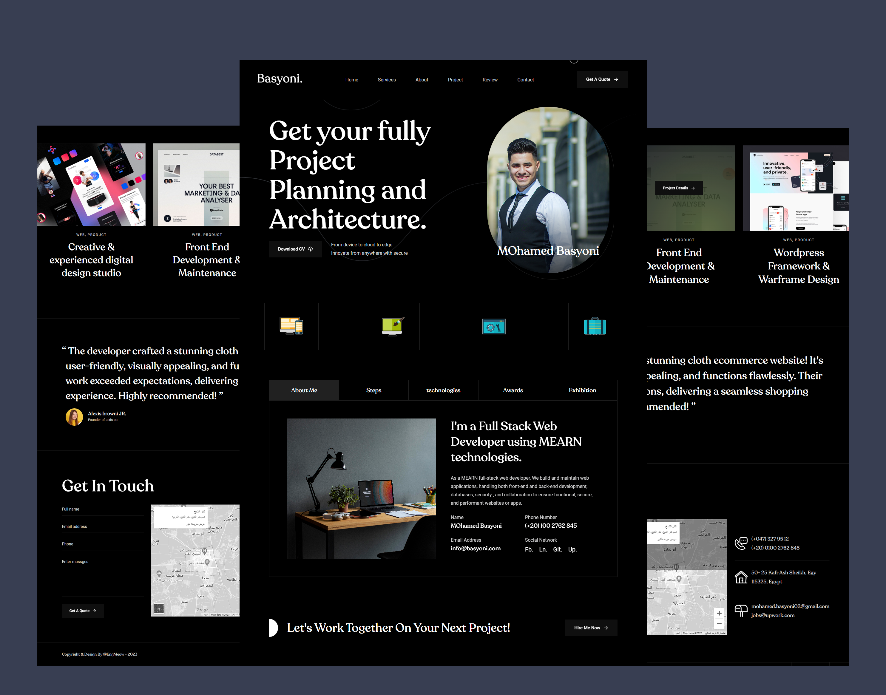

   
   

  <h2 align="center">Drew hays - Personal Portfolio Website</h2>

  Drew hays is a fully responsive personal portfolio website,  Responsive for all devices, build using HTML, CSS, and JavaScript.

  <a href="https://engmeow.github.io/personal-portfolio-demo/"><strong>➥ Live Demo</strong></a>

 

### Demo Screeshots

### Prerequisites

Before you begin, ensure you have met the following requirements:

* [Git](https://git-scm.com/downloads "Download Git") must be installed on your operating system.

### Contact

If you want to contact with me you can reach me at [Twitter](https://www.twitter.com/MOhamedBasyoni).

### License

[MIT](https://choosealicense.com/licenses/mit/)
